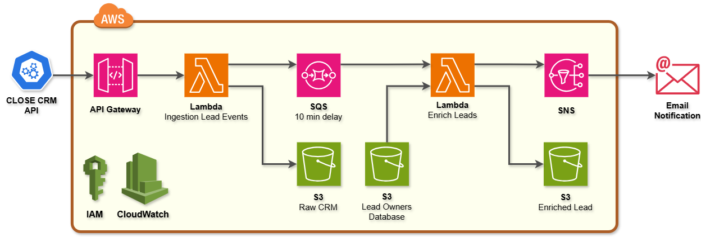

# Project 5: Real-Time CRM Lead Processing & Notification System
## 🧠 Overview
This project implements a real-time, event-driven data pipeline that captures newly created leads from Close CRM using webhooks and processes them through a serverless AWS architecture.
The pipeline ensures:
- Immediate ingestion of CRM lead events
- A controlled delay to allow CRM lead owner assignment
- Data enrichment via external lookup
- Reliable email notifications to the sales team

## 🎯 Business Objective
Sales teams often miss opportunities due to delays between lead creation and ownership assignment in CRM systems.
This project solves that problem by:
- Capturing lead creation events in real time
- Waiting 10 minutes for CRM updates
- Enriching lead data with ownership details
- Sending actionable notifications via email

## 🧩 Architecture

```json
Close CRM
   ↓ (Webhook)
API Gateway
   ↓
Lambda #1 – Webhook Ingest
   ↓
S3 Raw Bucket (crm/)
   ↓
SQS (10-minute delay)
   ↓
Lambda #2 – Enrich & Notify
   ↓
S3 Enriched Bucket (leads/)
   ↓
SNS → Email Notification
```
## 🔔 Notification
Email notifications are sent via Amazon SNS with the following details:
- Lead Name
- Lead ID
- Created Date
- Status Label
- Lead Email
- Lead Owner
- Funnel

### 📬 Sample Notification Payload
Below is an example of the enriched lead notification sent via Amazon SNS (Email):
```json
{
  "alert": "New Lead Alert",
  "icon": "🔔",
  "name": "Guy Tamo",
  "lead_id": "lead_kCDifxlO1O8vdWMs7CYD18UX1mxq6tgl1mcCq6fUP6a",
  "created_date": "2026-01-12T18:28:47.530000+00:00",
  "status_label": "Interested",
  "lead_email": "guydrums86@gmail.com",
  "lead_owner": "Józsa Zalán",
  "funnel": "None"
}
```
## ✅ Results
✔ Real CRM events ingested successfully  
✔ 10-minute delay applied correctly  
✔ Lead owner enrichment completed  
✔ Enriched data stored in S3  
✔ Email notifications delivered reliably  

## 🔜 Future Enhancements
▶️ Slack notifications  
▶️ Dead-letter queue (DLQ)  
▶️ Data warehouse integration  
▶️ Lead scoring & ML models  

## 👤 Author
**Hadi Hosseini**  
Data Engineer | AI/ML Engineer | Biomedical Data Scientist  
➡️ www.linkedin.com/in/hadi468  
